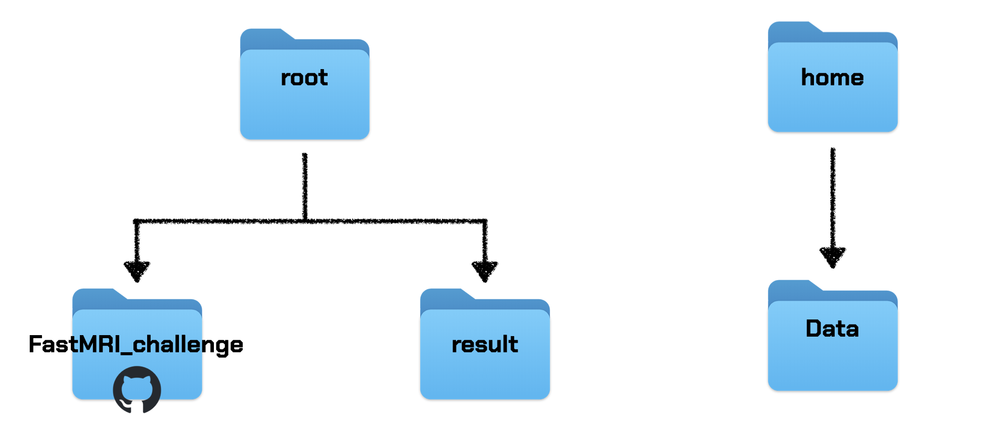
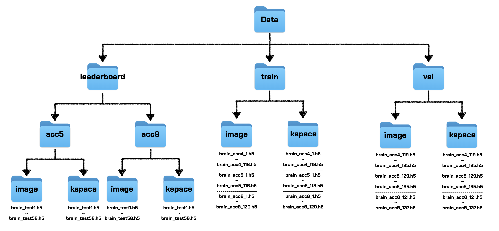

# 2024 SNU FastMRI challenge
2024 SNU FastMRI challenge 팀 암모나이트

## 1. 폴더 계층

### 폴더의 전체 구조


### Data 폴더의 구조


## 2. 폴더 정보

```bash
├── .gitignore
├── reconstruct_for_bebygan.py
├── reconstruct.py
├── leaderboard_eval.py
├── README.md
├── train.py
├── utils
│   ├── common
│   │   ├── loss_function.py
│   │   └── utils.py
│   ├── data
│   │   ├── load_data.py
│   │   └── transforms.py
│   ├── learning
│   │   ├── test_part.py
│   │   └── train_part.py
│   └── model
│       └── varnet.py
├── result
└── temp
		└── Simple-SR-master
				├── dataset
				│		 ├── mix_dataset.py
				│		 └── __init__.py
				├── demo
				├──	exps
				│		 └── BebyGAN
				│					 ├── config.py
				│					 ├── network.py
				│					 ├── reconstruct.py
				│					 ├── train.py
				│					 ├── train.sh
				│					 └── validate.py	  
				├── kernel
				├── logs
				└── utils 
						 ├── data_prep
						 ├── modules
						 ├── samplers
						 ├── common.py
						 ├── dataloader.py
						 ├── loss.py
						 ├── model_opr.py
						 ├── region_seperator.py
						 ├── resizer.py
						 └── solver.py
```

## 3. Before you start
* ```train.sh```, ```reconstruct.sh```, ```leaderboard_eval.sh``` 순으로 코드를 실행하면 됩니다.
* ```train.sh```
	 * train.sh은 세가지 코드를 실행시킵니다. Varnet을 학습시키는 train.py, BebyGAN 학습을 위한 데이터를 생성하는 reconstruct_for_bebygan.py, BebyGAN파일을 학습 시키는 train.py   
* ```reconstruct.sh```
   * reconstruct.sh은 두가지 코드를 실행시킵니다. Varnet을 통과하는 reconstruct.py. BebyGAN을 통과하는 reconstruct.py
* ```leaderboard_eval.sh```
   * leaderboard_eval.sh은 기존과 동일합니다.

## 4. How to set?
```
pip install -r requirements.txt 
```
* root/FastMRI_challenge/ 디렉토리에서 위 코드를 입력합니다.

## 5. How to train?
```
bash train.sh
```
- train.sh은 세가지 코드를 실행시킵니다. Varnet을 학습시키는 train.py, BebyGAN 학습을 위한 데이터를 생성하는 reconstruct_for_bebygan.py, BebyGAN파일을 학습 시키는 train.py
- validation할 때, reconstruction data를 ```result/reconstructions_val/```에 저장합니다.

## 6. How to reconstruct?
```
bash reconstruct.sh
```
- leaderboard 평가를 위한 reconstruction data를 ```result/reconstructions_leaderboard```에 저장합니다.

## 7. How to evaluate LeaderBoard Dataset?
```
bash leaderboard_eval.sh
```

## 8.모델 weight file
- Varnet 모델인 best_model.pt는 아래 디렉토리로 넣어주시면 됩니다
root/result/test_Varnet/checkpoints
- BebyGAN 모델인 20000_G.pth은 아래 디렉토리로 넣어주시면 됩니다
/root/FastMRI_challenge/temp/Simple-SR-master/exps/BebyGAN/log/models